<!--
  GitHub Profile README for Kylecodingwood
  Theme: tokyonight

  LeetCode: Fervent SinoussiGHW
  Stats cards: GitHub Actions → profile/*.svg
  Docs: https://github.com/anuraghazra/github-readme-stats
-->

  
  &nbsp;
  

  

  

---

### 🚀 About Me

> Software developer focused on building practical full-stack projects and sharpening problem-solving skills. Always learning, shipping, and iterating.

- 🧠 **Problem solving**: consistently practicing on [LeetCode](https://leetcode.com/u/Fervent%20SinoussiGHW/)
- 🛠️ **Building**: turning ideas into working products
- 📚 **Learning**: backend, frontend, and system design

---

### 🌟 Featured Projects

| Project | Description |
|---|---|
| 💻 **[CodingProject](https://github.com/Kylecodingwood/CodingProject)** | Coding project workspace |
| 🧭 **[JobHelper](https://github.com/Kylecodingwood/JobHelper)** | Job-hunting helper |

---

### 🛠 Tech Stack

#### 💻 Languages

[![][badge-java]][java-url]
[![][badge-typescript]][typescript-url]
[![][badge-python]][python-url]
[![][badge-sql]][sql-url]

#### ⚙️ Backend / Frontend

[![][badge-spring]][spring-url]
[![][badge-react]][react-url]
[![][badge-nextjs]][nextjs-url]
[![][badge-docker]][docker-url]
[![][badge-git]][git-url]
[![][badge-github]][github-url]

---

### 📈 LeetCode

---

[badge-java]: https://img.shields.io/badge/Java-ED8B00?style=for-the-badge&logo=openjdk&logoColor=white
[java-url]: https://www.java.com

[badge-typescript]: https://img.shields.io/badge/TypeScript-3178C6?style=for-the-badge&logo=typescript&logoColor=white
[typescript-url]: https://www.typescriptlang.org

[badge-python]: https://img.shields.io/badge/Python-3776AB?style=for-the-badge&logo=python&logoColor=white
[python-url]: https://www.python.org

[badge-sql]: https://img.shields.io/badge/SQL-336791?style=for-the-badge&logo=postgresql&logoColor=white
[sql-url]: https://en.wikipedia.org/wiki/SQL

[badge-spring]: https://img.shields.io/badge/Spring%20Boot-6DB33F?style=for-the-badge&logo=springboot&logoColor=white
[spring-url]: https://spring.io/projects/spring-boot

[badge-react]: https://img.shields.io/badge/React-61DAFB?style=for-the-badge&logo=react&logoColor=black
[react-url]: https://react.dev

[badge-nextjs]: https://img.shields.io/badge/Next.js-000000?style=for-the-badge&logo=nextdotjs&logoColor=white
[nextjs-url]: https://nextjs.org

[badge-docker]: https://img.shields.io/badge/Docker-2496ED?style=for-the-badge&logo=docker&logoColor=white
[docker-url]: https://www.docker.com

[badge-git]: https://img.shields.io/badge/Git-F05032?style=for-the-badge&logo=git&logoColor=white
[git-url]: https://git-scm.com

[badge-github]: https://img.shields.io/badge/GitHub-181717?style=for-the-badge&logo=github&logoColor=white
[github-url]: https://github.com
